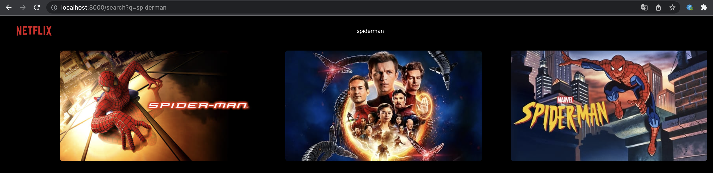

# React Netflix Application

GitHub Pages<br/>
[Netflix DEMO](https://khakikokyo.github.io/react-netflix/)

`React` Netflix Project

# 기능 소개

`Nav.js` scroll 이벤트를 적용한 네비게이션 바를 생성하고, BrowserRouter를 사용하여 3개의 `pages`를 구분하여 `App.js` 메인 화면을 구현하였습니다. axios 외부 라이브러리로 `The Movie DB API`에서 현재 상영중인 영화 정보, 아이디, 특정 영화의 상세 정보를 가져와 메인 이미지 배너를 생성하고, play 버튼을 클릭시 비디오로 전환, Iframe으로 해당 영화의 유튜브 비디오를 재생합니다.

장르별로 영화를 나열하고, swiper 모듈로 슬라이드 기능 및 터치 슬라이드를 구현하였습니다. 나열된 영화를 클릭시 자세히 보기 모달창을 띄워 간단한 영화 정보를 확인하실 수도 있습니다.

NavBar에 검색창을 생성하고, 영화 제목을 통해 원하는 영화를 검색할 수 있고, 검색된 영화 포스터를 클릭하면 영화 상세 페이지로 이동합니다.

# 기능 상세 소개

1. 네비게이션 생성하기

```javascript
// Nav.js
const [show, setShow] = useState(false);

// 스크롤 시 NavBar 색상 변경
useEffect(() => {
  window.addEventListener("scroll", () => {
    console.log("window.scrollY : ", window.scrollY);
    if(window.scrollY > 50) {
      setShow(true);
    } else {
      setShow(false);
    }
  });

  return () => {
    window.removeEventListener("scroll", () => {});
  }
}, []);

return (
  <nav className={`nav ${show && "nav__black"}`}>
    [...]
  </nav>
)
```

2. 이미지 배너 생성


```javascript
// Banner.js
const [movie, setMovie] = useState([]);

useEffect(() => {
  fetchData();
}, []);

const fetchData = async () => {
  // 현재 상영중인 여러 영화 정보 가져오기
  const request = await axios.get(requests.fetchNowPlaying);
  
  // 여러 영화 중 영화 하나의 ID 가져오기
  const movieId = request.data.results[
    Math.floor(Math.random() * request.data.results.length)
  ].id;

  // 특정 영화의 상세 정보 가져오기(비디오 정보 포함)
  const {data: movieDetail} = await axios.get(`movie/${movieId}`, {
    params: {append_to_reponse: "videos"}
  });
  setMovie(movieDetail);
};

// overview 설명글이 100자 이상인 경우 자른 후 ... 붙이기
const truncate = (str, n) => {
  return str?.length > n ? str.substr(0, n - 1) + "..." : str;
}

<h1 className="banner__description">{truncate(movie.overview, 100)}</h1>
```

3. 비디오 배너 생성

- Iframe: Iframe은 HTML Inline Frame 요소이며 inline frame의 약자이다.<br/>
**효과적으로 다른 HTML 페이지를 현재 페이지에 포함**시키는 중첩된 브라우저로 iframe 요소를 이용하면 해당 웹 페이지 안에 어떠한 제한없이 **다른 페이지를 불러와서 삽입**할 수 있다.


```javascript
// Banner.js
// play 버튼 클릭 시 비디오로 전환
const [isClicked, setIsClicked] = useState(false);

if(!isClicked) {
  return (
    [...]
    <button className="banner__button play" onClick={() => {setIsClicked(true)}}>Play</button>
  )
} else {
  return (
    // Styled Component를 이용한 UI 생성, Iframe으로 유튜브 비디오 재생
    <Container>
      <HomeContainer>
        <Iframe
          width="640"
          height="360"
          src={`https://www.youtube.com/embed/${movie.videos.results[0].key}
          ?controls=0&autoplay=1&loop=1&mute=1&playlist=${movie.videos.results[0].key}`}
          title="YouTube video player"
          frameborder="0"
          allow="autoplay; fullscreen"
          allowfullscreen
        ></Iframe>
      </HomeContainer>
    </Container>
  )
}
```

4. 영화 나열


```javascript
// pages > MainPage > index.js
// api > requests.js
import requests from './api/requests';

<Row
  title="NETFLIX ORIGINALS"
  id="NO"
  fetchUrl={requests.fetchNetflixOriginals}
  isLargeRow
/>
```

```javascript
// Row.js
// 영화 정보 가져오기
const [movies, setMovies] = useState([]);

useEffect(() => {
  fetchMovieData();
});

const fetchMovieData = async () => {
  const request = await axios.get(fetchUrl);
  setMovies(request.data.results);
};
```

5. 슬라이드 기능 추가

```javascript
// Row.js
<div className="slider__arrow-left">
  <span className="arrow"
    onClick={() => {
      document.getElementById(id).scrollLeft -= window.innerWidth - 80;
    }}>{"<"}</span>
</div>

<div className="slider__arrow-right">
  <span className="arrow"
    onClick={() => {
      document.getElementById(id).scrollLeft += window.innerWidth - 80;
    }}>{">"}</span>
</div>
```

6. 슬라이드 기능 swiper 모듈로 변경, 터치 슬라이드 추가 구현

```bash
$ npm i swiper
```

```javascript
// Row.js
// Import Swiper core and required modules
import { Navigation, Pagination, Scrollbar, A11y } from "swiper";
import { Swiper, SwiperSlide } from "swiper/react";

// Import Swiper Styles
import "swiper/css";
import "swiper/css/navigation";
import "swiper/css/pagination";
import "swiper/css/scrollbar";

<Swiper
  // install Swiper Modules
  modules={[Navigation, Pagination, Scrollbar, A11y]}
  navigation
  pagination={{ clickable: true }}
  loop={true}
  breakpoints={`{`
    1378: {
      slidesPerView: 6,
      slidesPerGroup: 6,
    },
    998: {
      slidesPerView: 5,
      slidesPerGroup: 5,
    },
    625: {
      slidesPerView: 4,
      slidesPerGroup: 4,
    },
    0: {
      slidesPerView: 3,
      slidesPerGroup: 3,
    },
  `}`}
>
  <SwiperSlide>[...]</SwiperSlide>
</Swiper>
```

7. 영화 클릭 시 자세히 보기 모달


```javascript
// Row.js
const [modalOpen, setModalOpen] = useState(false);
const [movieSelected, setMovieSelected] = useState({});

const handleClick = (movie) => {
  // 해당 영화 클릭 시 모달 Open
  setModalOpen(true);
  // 클릭한 영화의 정보 가져오기
  setMovieSelected(movie);
};

{modalOpen && <MovieModal {...movieSelected} setModalOpen={setModalOpen} />}
```

8. 영화 검색 & 영화 데이터(경로) 가져오기



```javascript
// Nav.js
// NavBar에 검색 Input 생성
const [searchValue, setSearchValue] = useState("");
const navigate = useNavigate();

// useNavigate()로 경로 담기
const handleChange = (e) => {
  setSearchValue(e.target.value);
  navigate(`/search?q=${e.target.value}`);
};

return (
  <input
    value={searchValue}
    onChange={handleChange}
    className="nav__input"
    type="text"
    placeholder="영화를 검색해 주세요."
  />
)
```

```javascript
// pages > SearchPage > index.js
// useLocation() Hooks를 사용하여 현재 위치 객체를 반환
const useQuery = () => {
  return new URLSearchParams(useLocation().search);
};

let query = useQuery();

// useLocation() Hooks로 담은 search의 값을 가져오기(검색바에 입력한 값(경로) 가져오기)
const searchTerm = query.get("q");

// searchTerm이 변경될 때마다 새로운 영화 데이터를 가져오기
const [searchResults, setSearchResults] = useState([]);

useEffect(() => {
  if(searchTerm) {
    fetchSearchMovie(searchTerm);
  }
}, [searchTerm]);

const fetchSearchMovie = async (searchTerm) => {
  try {
    const request = await axios.get(
      `/search/multi?include_adult=false&query=${searchTerm}`
    )
    setSearchResults(request.data.results);
  } catch(error) {
    console.log("error", error);
  }
};
```

9. 검색 페이지 UI 구현

```javascript
// pages > SearchPage > index.js
// searchTerm에 해당 영화 데이터가 있는 경우
const renderSearchResults = () => {
  return searchResults.length > 0 ? (
    <section className="search-container">
      {searchResults.map((movie) => {
        if(movie.backdrop_path !== null && movie.media_type !== "person") {
          const movieImageUrl = "https://image.tmdb.org/t/p/w500" + movie.backdrop_path
          return(
            [...]
          )
        }
      })}
    </section>
  // searchTerm에 해당 영화 데이터가 없는 경우
  ) : (
    <section className="no-results">
      <div className="no-results__text">
        <p>찾고자 하는 검색어 "{searchTerm}"에 맞는 영화가 없습니다.</p>
      </div>
    </section>
  )
}

return renderSearchResults();
```

10. useDebouncd Custom Hooks

    검색 입력을 할 때 결과가 나타날 때까지 시간이 걸리는 것을 debounce라는 함수에 의해서 제어를 할 수 있다. Debounce Function은 사용자가 설정한 시간 동안 타이핑을 멈출 때까지 keyup 이벤트 처리를 지연시킨다.

- Debounce의 장점

    1. UI 코드가 모든 이벤트를 처리할 필요가 없다.
    2. 서버로 전송되는 API 호출이 크게 줄어든다.
    3. 입력된 모든 문자를 처리하면 성능이 저하되는 것을 막을 수 있다.
    4. 백엔드에 불필요한 로드를 추가하지 않는다.

    Input 창에 글씨를 쓸 때 onChange로 값을 받을 때 debounce를 사용하지 않으면 글자 하나하나가 변할 때마다 값을 바꾸지만 debounce를 사용하면 결과값만 얻을 수 있다.

```javascript
// hooks > useDebounce.js
// useDebounce Hook을 만들어 주고, setTimeout을 걸어 시간을 늦춰주게 만들어 준다.
const useDebounce = (value, delay) => {
  
  const [debounceValue, setDebounceValue] = useState(value);

  useEffect (() => {
    const handler = setTimeout(() => {
      setDebounceValue(value);
    }, delay);

    return () => {
      clearTimeout(handler);
    };
  }, [value, delay]);

  return debounceValue;

}
```

11. 영화 상세 페이지


```javascript
// pages > SearchPage > index.js
// 포스터 클릭 시 상세페이지로 이동
<div
  onClick={() => {navigate(`/${movie.id}`)}}
  className="movie__column-poster"
>
  
</div>
```

```javascript
// pages > DetailPage > index.js
const { movieId } = useParams();
const [movie, setMovie] = useState({});

// 상세페이지에서 영화 상세 정보 데이터 가져오기
useEffect (() => {
  async function fetchData() {
    const request = await axios.get(
      `/movie/${movieId}`
    )
    setMovie(request.data);
  }
  fetchData();
}, [movieId]);
```

12. GitHub Pages 배포

```bash
# gh-pages 모듈 설치
$ npm i gh-pages --save-dev

# git 저장소 연결
$ git add .
$ git commit -m "first commit"
$ git branch -M main
$ git remote add origin https://github.com/khakikokyo/react-netflix
$ git push -u origin main
```

```javascript
// index.js
// BroserRouter에 basename 속성 추가 (PUBLIC_URL: package.json에서 설정한 homepage URL이 적용)
<BrowserRouter basename={process.env.PUBLIC_URL}>
  <App />
</BrowserRouter>
```

```javascript
// package.json
{
  // 홈페이지 URL 작성
  "homepage": "https://khakikokyo.github.io/react-netflix",

  // 배포를 위한 script 추가
  "scripts": {
    "predeploy": "npm run build",
    "deploy": "gh-pages -d build"
  }
}
```

```bash
# deploy
$ npm run deploy
```

# The Movie DB API

1. [The MovieDB Website](https://www.themoviedb.org/) 이동
2. 가입 후 로그인 & API_KEY 받기
3. Text Editor에서 the MovieDB API를 위한 설정

```bash
# Get Movie By Latest (최신 영화 받기)
https://api.themoviedb.org/3/movie/latest?api_key=<<api_key>>&language=en-US
```

```bash
# Get Movie Detail (영화 정보 얻기)
https://api.themoviedb.org/3/movie/{movie_id}?api_key=<<api_key>>&language=en-US
```

```bash
# Get Movie Reviews (영화평)
https://api.themoviedb.org/3/movie/{movie_id}/reviews?api_key=<<api_key>>&language=en-US&page=1
```

```bash
# Get Trending (트렌드)
https://api.themoviedb.org/3/movie/latest?api_key=<<api_key>>&language=en-US
```